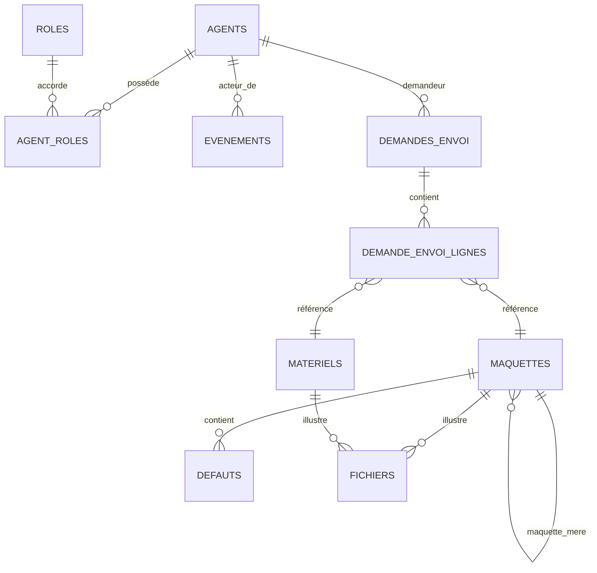

# Cadrage OGADE — Migration Power Apps vers Web

**Document issu de la phase de cadrage Q/R du 2026-04-21**
**Branche** : `claude/analyze-power-apps-1YBtF`
**Source cartographie** : [CARTOGRAPHIE_OGADE.md](./CARTOGRAPHIE_OGADE.md)

---

## 0. Synthèse exécutive

Synthèse des décisions prises lors de la phase de cadrage :

| Axe | Décision |
|---|---|
| Backend de données | **PostgreSQL** (abandon complet de SharePoint pour les données métier) |
| Stockage fichiers | **Azure Blob Storage** (migration depuis SharePoint Documents) |
| Frontend web | Framework **React + TypeScript** (custom, pas de low-code) |
| Backend API | **Node.js + TypeScript (NestJS)** |
| Cible mobile (phase 2) | **Android tablette**, codebase réutilisé depuis le web |
| Authentification | **SSO Azure AD** (MSAL) |
| Autorisation | Modèle **hybride** : groupes AD (rôles techniques) + table applicative (rôles métier) |
| Hébergement | **Conteneurs** (Docker) |
| Internationalisation | **FR uniquement** |
| Offline | **Non requis** |
| QR code | **Génération interne** (lib serveur) |
| Scan QR/barcode | Caméra navigateur + app native mobile |
| Emails | Conservés via **Power Automate** dans un premier temps |
| 3D / Mixed Reality | **Hors périmètre** (fonctions non utilisées) |
| Admin des droits | **Incluse** dans le périmètre v1 |
| Reprise historique SP | **Second temps** (post-bascule) |
| Stratégie de bascule | **Big Bang** |
| Pilote bêta | **Gestionnaires de maquettes** |
| Sort de Power Apps | **Gel** après bascule |

---

## 1. Périmètre fonctionnel retenu

### 1.1 Fonctionnalités incluses (v1)

Repris depuis Power Apps — écrans et flux métier à porter :

- **Gestion des matériels END**
  - Liste, recherche, fiche matériel (consultation / édition)
  - Création de matériel (formulaire + génération QR)
  - Envoi / réception / prêt / retour / rebut
  - Historique des mouvements (via nouvelle table événements, cf. §5)
- **Gestion des maquettes**
  - Liste, recherche, fiche maquette (consultation / édition)
  - Création de maquette
  - Cycle de vie : emprunt → retour → contrôle → réutilisation / rebut
  - Emprunt maquette (écran **ScreenEmpruntMaquette** retenu, Screen10 écarté)
  - Gestion des défauts (table dédiée, cf. §5)
- **Demandes d'envoi mutualisées** (matériel + maquette fusionnées, cf. §5)
  - Création / suivi / validation / réception
- **Module logistique (magasin)**
  - Menu magasin (réservé aux rôles magasinier / référent logistique DQI / référent maquette / admin matériels)
- **Réception multiple** (🆕 à finir / recoder — aujourd'hui désactivée en PA)
- **Administration des droits** (🆕 à créer — aujourd'hui gérée manuellement dans SharePoint)
- **RBAC** : gestion des rôles utilisateur (cf. §6)
- **Génération de QR codes** (déplacée côté serveur)

### 1.2 Fonctionnalités exclues / à supprimer

| Élément | Motif |
|---|---|
| Écrans suffixés `_OLD` | Résidus historiques — suppression |
| `Screen10` | Doublon de `ScreenEmpruntMaquette` — abandon |
| `Screen11` | Template prototype non finalisé — hors périmètre |
| `Component1` | Composant déclaré mais non instancié — résidu |
| `ViewIn3D` / `ViewInMR` | Non utilisées en production |
| Stockage SharePoint des données métier | Remplacé par PostgreSQL |

### 1.3 Nouveauté v1

**Réception multiple matériels / maquettes** : fonctionnalité absente en PA (bouton désactivé), à concevoir et implémenter dans le web. Elle permettra de réceptionner en une seule opération plusieurs éléments d'une même demande d'envoi.

### 1.4 Hors périmètre v1 (renvoyé en v2)

- Reprise de l'historique SharePoint (ETL) — post bascule
- Application mobile native Android (React Native / Capacitor) — post v1 web
- Intégration emails applicatifs (reste via Power Automate dans l'intervalle)
- Pilotage / reporting BI / intégration DataLake

---

## 2. Volumétrie & objectifs de dimensionnement

### 2.1 Utilisateurs

| Indicateur | Valeur actuelle | Cible 3-5 ans |
|---|---|---|
| Utilisateurs nominatifs | ~500 | ~500 (stable) |
| Utilisateurs actifs / jour | ~20 | ~40 |
| Pics d'usage | non significatifs | non significatifs |

**Implication dimensionnement** : charge faible à modérée — **1 instance API** suffit en production, avec redondance N+1 pour haute disponibilité. Pas de besoin d'autoscaling agressif.

### 2.2 Données

| Entité | Volume actuel | Volume cible (x2) | Commentaire |
|---|---|---|---|
| Matériels END | ~5 000 items | ~10 000 | Croissance x2 attendue |
| Maquettes | ~5 000 items | ~10 000 | Croissance x2 attendue |
| Demandes d'envoi (fusionnées) | ~50 / mois | ~100 / mois | Flux mensuel |
| Historique d'événements | à créer | ~100k lignes / 5 ans | Event sourcing léger |
| Défauts maquettes | à créer (extrait JSON) | ~20-50k lignes | Relation 1-N |
| Agents / rôles | ~500 | ~500 | Stable |

### 2.3 Fichiers

| Indicateur | Valeur |
|---|---|
| Nombre de photos (matériels + maquettes) | ~10 000 (2 photos par élément) |
| PV de contrôle (PDF) | volumétrie à préciser |
| Stockage cible | **Azure Blob Storage** |
| Stockage médian estimé | ~20-50 GB |

**Implication** : volumétrie très raisonnable — PostgreSQL single-node (~1 vCPU / 2 GB RAM) suffit amplement.

---

## 3. Stack technique retenue

### 3.1 Vue d'ensemble

| Couche | Techno | Rationale |
|---|---|---|
| Frontend web | **React 18 + TypeScript + Vite** | Standard industriel, large écosystème, réutilisable en React Native |
| UI kit | **TailwindCSS + shadcn/ui** (ou Material UI) | Productivité, DX, accessibilité |
| State / data | **TanStack Query** (React Query) | Caching requêtes API, mutations, optimistic updates |
| Formulaires | **React Hook Form + Zod** | Validation partagée client/serveur |
| Backend API | **NestJS (Node.js 20 + TypeScript)** | Architecture modulaire, OpenAPI out-of-the-box, DI |
| ORM | **Prisma** | Type-safety bout en bout, migrations versionnées |
| Base de données | **PostgreSQL 15+** | Relationnel mature, JSON natif, extensions (pg_trgm pour recherche) |
| Stockage fichiers | **Azure Blob Storage** | SDK officiel, URLs pré-signées (SAS) |
| Auth | **MSAL (Azure AD)** côté web + **passport-azure-ad** (OIDC) côté API | SSO EDF |
| QR | **`qrcode`** (npm, serveur) + **`html5-qrcode`** (scan web) | Génération interne, zéro dépendance externe |
| Conteneurs | **Docker** | Image multi-stage, image API + image web (ou monorepo) |
| Orchestration | **Azure Container Apps** ou **Kubernetes EDF** | À arbitrer selon l'offre interne |
| CI/CD | **GitHub Actions** (ou Azure DevOps) | Selon la plateforme SCM retenue |
| Tests | **Vitest** (front), **Jest + Supertest** (back), **Playwright** (E2E) | |
| Observabilité | **OpenTelemetry** + collecteur (Application Insights / Prometheus-Grafana) | Logs / traces / métriques |

### 3.2 Justification — pourquoi ce stack

1. **Mobile natif Android futur** : React Native (Expo) permet de réutiliser 60-80 % du code (logique métier, validation Zod, types API, contrats DTO). Alternative Capacitor aussi envisageable (plus rapide à porter) — arbitrage en phase 2.
2. **TypeScript bout en bout** : un seul langage front + back + mobile, partage des types (contrats API), réduction des bugs d'intégration.
3. **Custom (pas de low-code)** : conforme à l'exigence — contrôle total sur l'UX, les performances, la portabilité mobile.
4. **Hébergement conteneurs** : Docker donne la flexibilité (Azure Container Apps, AKS, autre cluster K8s EDF).
5. **Volumétrie modérée** : Node.js + PostgreSQL couvrent 100x la charge actuelle.

### 3.3 Alternatives écartées

| Alternative | Motif du rejet |
|---|---|
| **Angular + Java/Spring** | Plus lourd, moins de mutualisation avec mobile |
| **Next.js (Vercel-centric)** | Pas besoin de SSR pour une app interne authentifiée ; complexifie l'hébergement conteneurs |
| **Power Pages / Mendix / OutSystems** | Exigence explicite : pas de low-code |
| **Flutter** | Excellent pour le mobile, mais écosystème web moins mature — on accepte moins de réutilisation mobile |
| **.NET 8 + Blazor** | Viable ; écarté pour ne pas introduire un 2e langage (C#) dans la stack — si EDF a des devs .NET disponibles, à réévaluer |

### 3.4 Monorepo vs polyrepo

**Recommandation** : **monorepo** (`pnpm workspaces` ou `turborepo`) avec :
```
/apps
  /web          → app React
  /api          → app NestJS
  /mobile       → app React Native (phase 2)
/packages
  /shared       → types, schemas Zod, utilitaires
  /ui           → composants UI partagés web/mobile (phase 2)
/infra
  /docker       → Dockerfiles
  /k8s          → manifests / helm
```
Cela maximise le partage de code et simplifie la CI.

---

## 4. Architecture applicative cible

### 4.1 Schéma logique

```
┌────────────────────────────────────────────────────────────────┐
│                       Utilisateurs EDF                         │
│           (PC web + tablette web + Android natif v2)           │
└───────────────┬────────────────────────────────────────────────┘
                │ HTTPS + SSO Azure AD
                ▼
┌────────────────────────────────────────────────────────────────┐
│         Reverse Proxy / Ingress (Azure Front Door / Nginx)     │
└──────────────┬───────────────────────────────┬─────────────────┘
               │                               │
               ▼                               ▼
   ┌──────────────────────┐         ┌──────────────────────┐
   │  App Web (React)     │         │  API (NestJS)        │
   │  - Static assets     │────────▶│  - REST /api/v1/*    │
   │  - MSAL SPA          │  token  │  - Auth OIDC         │
   └──────────────────────┘         └──────┬───────────────┘
                                           │
                 ┌─────────────────────────┼─────────────────────┐
                 ▼                         ▼                     ▼
       ┌──────────────────┐   ┌──────────────────────┐   ┌──────────────────┐
       │  PostgreSQL      │   │  Azure Blob Storage  │   │  Azure AD        │
       │  (données métier)│   │  (photos, PV PDF)    │   │  (rôles AD)      │
       └──────────────────┘   └──────────────────────┘   └──────────────────┘

       ┌──────────────────────────────────────────────┐
       │  Power Automate (conservé pour emails v1)    │◀── API webhook
       └──────────────────────────────────────────────┘

       ┌──────────────────────────────────────────────┐
       │  SharePoint (MOD'OP PDF — lien externe seul) │◀── Launch() depuis UI
       └──────────────────────────────────────────────┘
```

### 4.2 Pattern d'API

- **REST** (OpenAPI 3 auto-généré par NestJS)
- Endpoints groupés : `/materiels`, `/maquettes`, `/demandes-envoi`, `/defauts`, `/historique`, `/agents`, `/upload`
- **Pagination** : `?page=&pageSize=` avec `X-Total-Count`
- **Filtrage** : query params structurés
- **Versionning** : préfixe `/v1/`
- **Uploads** : upload direct client → Blob via **URLs SAS pré-signées** émises par l'API (pas de proxy via API, allège la charge)

### 4.3 Sécurité

- HTTPS obligatoire (TLS 1.2+)
- Tokens Azure AD validés côté API (signature + audience + issuer + exp)
- RBAC check à chaque endpoint via guards NestJS
- CORS restreint au domaine web
- Rate limiting (ex. 100 req/min/user)
- Headers sécurité : `Helmet`
- Logs applicatifs sans PII sensible

---

## 5. Modèle de données cible (PostgreSQL)

### 5.1 Principes

- **Clés techniques** : colonnes `id BIGSERIAL PRIMARY KEY` partout (ne pas exposer les IDs SharePoint)
- **Clés fonctionnelles** : colonnes explicites (ex. `reference`, `numero_demande`) avec `UNIQUE`
- **Audit** : toutes les tables ont `created_at`, `updated_at`, `created_by`, `updated_by`
- **Soft delete** : colonne `deleted_at` (nullable) plutôt que suppression physique
- **Timestamps** : `TIMESTAMPTZ` (timezone-aware)
- **Nommage** : `snake_case`, tables au pluriel, colonnes au singulier
- **FKs** : `ON DELETE RESTRICT` par défaut (pas de cascade implicite sur données métier)

### 5.2 Tables principales (aperçu)

#### `agents` — utilisateurs OGADE
```sql
CREATE TABLE agents (
  id                BIGSERIAL PRIMARY KEY,
  azure_ad_object_id UUID UNIQUE NOT NULL,    -- oid Azure AD
  email             TEXT UNIQUE NOT NULL,
  nom               TEXT NOT NULL,
  prenom            TEXT NOT NULL,
  actif             BOOLEAN NOT NULL DEFAULT true,
  created_at        TIMESTAMPTZ NOT NULL DEFAULT now(),
  updated_at        TIMESTAMPTZ NOT NULL DEFAULT now()
);
CREATE INDEX idx_agents_email ON agents(email);
```

#### `roles` + `agent_roles` — RBAC applicatif (cf. §6.2)
```sql
CREATE TABLE roles (
  id     BIGSERIAL PRIMARY KEY,
  code   TEXT UNIQUE NOT NULL,     -- ex: MAGASINIER, REFERENT_MAQUETTE
  label  TEXT NOT NULL,
  description TEXT
);
CREATE TABLE agent_roles (
  agent_id BIGINT NOT NULL REFERENCES agents(id) ON DELETE CASCADE,
  role_id  BIGINT NOT NULL REFERENCES roles(id) ON DELETE RESTRICT,
  granted_at TIMESTAMPTZ NOT NULL DEFAULT now(),
  granted_by BIGINT REFERENCES agents(id),
  PRIMARY KEY (agent_id, role_id)
);
```

#### `maquettes`
```sql
CREATE TABLE maquettes (
  id                BIGSERIAL PRIMARY KEY,
  reference         TEXT UNIQUE NOT NULL,
  maquette_mere_id  BIGINT REFERENCES maquettes(id),   -- unifie le typage (§9.4)
  libelle           TEXT NOT NULL,
  etat              TEXT NOT NULL,                     -- enum : STOCK / EMPRUNTEE / EN_CONTROLE / REBUT...
  localisation      TEXT,
  proprietaire_id   BIGINT REFERENCES agents(id),
  -- ... autres champs métier issus de la liste SharePoint
  created_at        TIMESTAMPTZ NOT NULL DEFAULT now(),
  updated_at        TIMESTAMPTZ NOT NULL DEFAULT now(),
  created_by        BIGINT REFERENCES agents(id),
  updated_by        BIGINT REFERENCES agents(id),
  deleted_at        TIMESTAMPTZ
);
CREATE INDEX idx_maquettes_etat ON maquettes(etat) WHERE deleted_at IS NULL;
```

#### `materiels`
Structure analogue à `maquettes`, avec champs spécifiques (type de matériel END, numéro de série, date d'étalonnage, etc.).

#### `defauts` — 🆕 extraction du JSON embarqué (§9.2)
```sql
CREATE TABLE defauts (
  id             BIGSERIAL PRIMARY KEY,
  maquette_id    BIGINT NOT NULL REFERENCES maquettes(id) ON DELETE CASCADE,
  type_defaut    TEXT NOT NULL,       -- ex : FISSURE, CORROSION, DEFORMATION
  position       TEXT,                -- ex : coordonnées ou zone
  dimension      TEXT,
  photo_blob_key TEXT,                -- clé Azure Blob
  description    TEXT,
  severite       TEXT,                -- enum : MINEUR, MAJEUR, CRITIQUE
  detecte_le     DATE NOT NULL,
  detecte_par_id BIGINT REFERENCES agents(id),
  created_at     TIMESTAMPTZ NOT NULL DEFAULT now()
);
CREATE INDEX idx_defauts_maquette ON defauts(maquette_id);
```

#### `demandes_envoi` — 🆕 fusion des 2 listes SP (§9.1)
```sql
CREATE TABLE demandes_envoi (
  id                BIGSERIAL PRIMARY KEY,
  numero            TEXT UNIQUE NOT NULL,         -- auto-incrémenté formaté
  type              TEXT NOT NULL,                -- enum : MATERIEL, MAQUETTE, MUTUALISEE
  demandeur_id      BIGINT NOT NULL REFERENCES agents(id),
  destinataire      TEXT NOT NULL,
  site_destinataire TEXT,
  motif             TEXT,
  date_souhaitee    DATE,
  statut            TEXT NOT NULL,                -- enum : BROUILLON, ENVOYEE, EN_TRANSIT, RECUE, CLOTUREE, ANNULEE
  date_envoi        TIMESTAMPTZ,
  date_reception    TIMESTAMPTZ,
  commentaire       TEXT,
  created_at        TIMESTAMPTZ NOT NULL DEFAULT now(),
  updated_at        TIMESTAMPTZ NOT NULL DEFAULT now()
);
CREATE TABLE demande_envoi_lignes (
  id             BIGSERIAL PRIMARY KEY,
  demande_id     BIGINT NOT NULL REFERENCES demandes_envoi(id) ON DELETE CASCADE,
  materiel_id    BIGINT REFERENCES materiels(id),
  maquette_id    BIGINT REFERENCES maquettes(id),
  quantite       INTEGER NOT NULL DEFAULT 1,
  recue          BOOLEAN NOT NULL DEFAULT false,
  date_reception TIMESTAMPTZ,
  CHECK ((materiel_id IS NOT NULL) <> (maquette_id IS NOT NULL))   -- XOR
);
```

Le `CHECK` garantit qu'une ligne référence soit un matériel, soit une maquette — pas les deux.

#### `evenements` — 🆕 historique événementiel (§9.3)
```sql
CREATE TABLE evenements (
  id           BIGSERIAL PRIMARY KEY,
  entity_type  TEXT NOT NULL,        -- enum : MATERIEL, MAQUETTE, DEMANDE_ENVOI, DEFAUT
  entity_id    BIGINT NOT NULL,
  event_type   TEXT NOT NULL,        -- enum : CREATION, MODIFICATION, EMPRUNT, RETOUR, ENVOI, RECEPTION, CONTROLE, REBUT, ...
  payload      JSONB,                -- snapshot / diff du changement
  acteur_id    BIGINT REFERENCES agents(id),
  occurred_at  TIMESTAMPTZ NOT NULL DEFAULT now()
);
CREATE INDEX idx_evenements_entity ON evenements(entity_type, entity_id, occurred_at DESC);
CREATE INDEX idx_evenements_acteur ON evenements(acteur_id, occurred_at DESC);
```

Pattern **event sourcing léger** — permet de reconstituer l'historique d'une entité sans alourdir la table mère. Alimentation via triggers ou hooks applicatifs (Prisma middleware / NestJS interceptors).

#### `fichiers` — métadonnées Azure Blob
```sql
CREATE TABLE fichiers (
  id           BIGSERIAL PRIMARY KEY,
  entity_type  TEXT NOT NULL,
  entity_id    BIGINT NOT NULL,
  blob_key     TEXT UNIQUE NOT NULL,     -- chemin dans le container
  nom_original TEXT,
  mime_type    TEXT,
  taille_octets BIGINT,
  type         TEXT,                     -- enum : PHOTO, PV_CONTROLE, DOCUMENT
  uploaded_by  BIGINT REFERENCES agents(id),
  uploaded_at  TIMESTAMPTZ NOT NULL DEFAULT now()
);
CREATE INDEX idx_fichiers_entity ON fichiers(entity_type, entity_id);
```

### 5.3 Diagramme entité-relation (simplifié)



### 5.4 Décisions de normalisation récapitulatives

| Dette identifiée (cartographie §7) | Décision |
|---|---|
| 2 listes Demandes d'envoi (matériel + mutualisée) | **Fusion** → `demandes_envoi` + `demande_envoi_lignes` (avec discriminant `type`) |
| Défauts en JSON dans champ texte | **Extraction** → table `defauts` (1-N) |
| Historique implicite (champs datés) | **Table d'événements** → `evenements` (event sourcing léger) |
| ID mère hétérogène (texte / numérique) | **Unifié** → FK auto-référente `maquette_mere_id BIGINT` |
| Paniers en mémoire | **Volatils client** → état React Query / store local (pas de table `panier` côté BDD) |
| 2 listes de rôles SharePoint | **Consolidation** → `roles` + `agent_roles` (§6) |

### 5.5 Indexation & performances

- Recherche full-text sur `reference`, `libelle` via `pg_trgm` + index GIN
- Index composés sur les filtres fréquents (statut, date)
- Pagination par **keyset pagination** (seek method) pour les grandes listes
- EXPLAIN ANALYZE des requêtes critiques avant production

### 5.6 Migrations

- **Prisma Migrate** : fichiers SQL versionnés dans le repo
- Seed initial : rôles, agents pilotes, données de test
- Migration de données SP → PG : **scripts dédiés** en phase 2 (post-bascule), non bloquants pour le Big Bang

---

## 6. Authentification & RBAC

### 6.1 Authentification — SSO Azure AD

- **IdP unique** : Azure AD EDF (tenant d'entreprise)
- **Flow OAuth 2.0 / OIDC** :
  - Web (React) : **Authorization Code flow + PKCE** via `@azure/msal-react`
  - API (NestJS) : validation du **token JWT** (signature via JWKS, audience, issuer, expiration)
- **Pas de mot de passe applicatif** : 100 % délégation Azure AD
- **Session** : tokens stockés en mémoire (pas de localStorage) ; refresh silencieux via MSAL
- **Logout** : endpoint Azure AD standard + purge du cache MSAL

### 6.2 Autorisation — modèle hybride

Le RBAC combine **2 sources** :

#### Source 1 : Groupes Azure AD (rôles techniques)
Portés via les `groups` ou `roles` claims du token Azure AD. Exemples :
- `OGADE_Users` : accès général à l'application
- `OGADE_Admin` : accès à la console d'administration

Ces groupes sont gérés côté EDF / IAM et synchronisés via Azure AD. Pas de duplication en BDD.

#### Source 2 : Table `agent_roles` (rôles métier)
Portés en base de données, gérés via l'interface d'admin. Exemples (repris des listes SP actuelles) :
- `MAGASINIER`
- `REFERENT_LOGISTIQUE_DQI`
- `REFERENT_MAQUETTE`
- `ADMIN_MATERIELS` (ex-`OGADE_Matériels_Admin`)

#### Résolution combinée
À chaque requête API, le contexte utilisateur est construit :
```ts
interface AuthenticatedUser {
  azureAdOid: string;          // source Azure AD
  email: string;               // source Azure AD
  agentId: number;             // source BDD (agents.id)
  adGroups: string[];          // source Azure AD (claims)
  businessRoles: string[];     // source BDD (agent_roles)
}
```
Les **guards NestJS** vérifient la combinaison nécessaire à chaque endpoint (ex : `@Roles('MAGASINIER')` ou `@AdGroup('OGADE_Admin')`).

### 6.3 Interface d'administration des droits (🆕 v1)

Périmètre inclus dans la v1 :
- **Liste des agents** (synchronisée avec Azure AD à la connexion ou en batch nocturne)
- **Attribution / révocation des rôles métier** (MAGASINIER, REFERENT_*, ADMIN_MATERIELS)
- **Historique** : les modifications de rôles alimentent la table `evenements` (type `ROLE_GRANTED` / `ROLE_REVOKED`)
- Accès réservé au groupe AD `OGADE_Admin`

### 6.4 Provisionnement initial

- Import des 500 utilisateurs nominatifs depuis Azure AD (requête Graph API lors de la mise en production)
- Import des rôles métier depuis les 2 listes SharePoint `Agents et rôles OGADE` + `Agents et rôles` → consolidation manuelle ou semi-automatique (script de reprise)

---

## 7. Stockage fichiers

### 7.1 Azure Blob Storage

- **1 compte de stockage** dédié OGADE
- **Containers** :
  - `photos` : photos matériels et maquettes
  - `pv` : PV de contrôle (PDF)
  - `documents` : autres pièces jointes
- **Redondance** : LRS (zone unique) ou ZRS (multi-zone) selon exigence EDF
- **Tiering** : Hot pour toutes les données (volumétrie ~20-50 GB, coût marginal)

### 7.2 Convention de nommage des blobs

```
{entity_type}/{entity_id}/{uuid}-{nom_original}
Ex : maquette/1234/a1b2c3d4-photo_face.jpg
     materiel/5678/e5f6g7h8-pv_controle.pdf
```

### 7.3 Upload / download — URLs SAS pré-signées

**Upload** :
1. Client demande à l'API : `POST /api/v1/upload/sas?entity_type=maquette&entity_id=1234&mime=image/jpeg`
2. API vérifie les droits → génère une **SAS URL write-only** (15 min de validité) → renvoie l'URL + `blob_key`
3. Client upload direct vers Azure Blob (sans passer par l'API)
4. Client notifie l'API : `POST /api/v1/fichiers` avec `blob_key` → l'API enregistre la métadonnée

**Download** :
1. Client demande : `GET /api/v1/fichiers/{id}/url`
2. API vérifie les droits → génère une **SAS URL read-only** (5 min) → renvoie l'URL
3. Client consulte directement via navigateur

Avantages : pas de proxy lourd côté API, sécurité par expiration courte, scalabilité.

### 7.4 MOD'OP PDF

Conservé sur **SharePoint**. L'app se contente d'ouvrir l'URL existante dans un nouvel onglet (équivalent du `Launch(...)` Power Apps), pas de copie applicative.

---

## 8. Dépendances externes & intégrations

### 8.1 QR code — génération interne

- **Librairie** : `qrcode` (npm, côté serveur)
- **Endpoint** : `GET /api/v1/materiels/{id}/qr` ou `/maquettes/{id}/qr` → renvoie un PNG
- **Caching** : possible (QR stable tant que l'URL encodée ne change pas)
- **Abandon** : `api.qrserver.com` et `quickchart.io` ne sont plus appelés

### 8.2 Scan QR / code-barres

- **Web** : librairie `html5-qrcode` ou `@zxing/browser` — utilise l'API `getUserMedia` du navigateur
- **Mobile natif (v2)** : module natif (`react-native-vision-camera` + ML Kit)
- Compatibilité tablettes tactiles : testée sur Chrome Android et Edge Windows

### 8.3 Emails — Power Automate (conservé en v1)

- L'API expose un **webhook** que Power Automate appelle (pull) ou reçoit via événements sortants
- Les 5 flows existants sont **analysés et portés tels quels** ou réécrits côté API selon leur complexité
- **Décision différée** : remplacement par un service d'email applicatif (Microsoft Graph API / SMTP EDF) prévu en phase 2

### 8.4 Intégrations supprimées

| Ancienne dépendance | Remplacement |
|---|---|
| Connecteur SharePoint (données) | PostgreSQL via API NestJS |
| Connecteur SharePoint (documents) | Azure Blob Storage |
| `api.qrserver.com` / `quickchart.io` | `qrcode` (npm interne) |
| `ViewIn3D` / `ViewInMR` | Supprimé (fonctions non utilisées) |

### 8.5 Intégrations conservées

| Intégration | Usage |
|---|---|
| Azure AD | SSO + groupes |
| SharePoint | Hébergement du MOD'OP PDF (lien externe uniquement) |
| Power Automate | Emails (phase 1), migration possible en phase 2 |

---

## 9. Stratégie de bascule

### 9.1 Big Bang

Décision retenue : **Big Bang**. Pas de run parallèle, pas de double écriture.
- Date D : bascule complète
- D-1 : gel des écritures en Power Apps (lecture seule)
- J : reprise du delta final SharePoint → PostgreSQL, puis ouverture de l'app web
- J+1 : Power Apps désactivée (voir §9.4)

### 9.2 Phase pilote

- **Population pilote** : équipe **Gestionnaires de maquettes**
- **Durée** : ~2 semaines de pré-production sur environnement de recette
- **Objectifs** : valider les flux clés (création/emprunt/retour/envoi) et les performances
- Pas d'utilisateurs réels en écriture pendant le pilote (données de test ou bac à sable)

### 9.3 Stratégie de reprise des données

#### Reprise initiale (J - Big Bang)
Script de migration SP → PG pour le **stock courant uniquement** :
- Matériels END actifs
- Maquettes actives
- Demandes d'envoi en cours (statut != CLOTUREE)
- Agents et rôles
- Photos (récupération depuis SP, ré-upload vers Azure Blob, mise à jour des métadonnées)

#### Reprise historique (phase 2, post-bascule)
- Items clôturés / rebut / archivés
- Historique des mouvements (reconstitué comme événements `MIGRATION` datés de J)
- Script ETL dédié, exécuté hors charge
- Pas de blocage pour la bascule

### 9.4 Sort de Power Apps après bascule

- **Gel** : l'app reste accessible en **lecture seule** pendant une période de sécurité (3 mois suggérés)
- Publication d'un bandeau "Application archivée — utiliser OGADE Web"
- Au terme de la période : **désactivation** (retrait du lanceur EDF, désactivation des flows Power Automate)
- **Conservation** du `.msapp` et du package dans un espace d'archive

### 9.5 Environnements

| Env | Usage | Données |
|---|---|---|
| **dev** | Développement local | PG local / seed de test |
| **recette** | QA + pilote | Snapshot anonymisé ou jeu de test |
| **prod** | Production | Données réelles |

Migrations Prisma appliquées par CI/CD sur chaque env (pipeline dédié).

---

## 10. Contraintes projet (réponses finales)

| # | Question | Réponse |
|---|---|---|
| Q10.4 | Critères go/no-go pour la bascule | **Acceptés** (proposition §10.1 ci-dessous) |
| B.1 | Échéance contrainte | **Environ fin mai 2026** (~5 semaines) — pas d'échéance formelle |
| B.2 | Budget cadre | **Aucun budget** — 1 dev solo utilisant **Claude Code à 100 %** (offre Pro) |
| B.3 | Équipe projet | **1 développeur** (le porteur du projet) + **1 testeur métier** |
| B.4 | MOD'OP | **Décorrélée** du dev — mise à jour à la fin, après bascule |

### 10.1 Proposition de critères go/no-go bascule

**Go** si :
- 100 % des scénarios métier critiques couverts en recette (checklist à construire en début de projet)
- Performances : < 2s pour les listes paginées, < 5s pour les écritures complexes
- 0 bug critique ouvert, < 5 bugs majeurs ouverts
- Formation utilisateurs réalisée (session + MOD'OP à jour)
- Procédure de reprise testée sur jeu de données représentatif

**No-go** : report d'au moins 2 semaines + nouveau comité de bascule.

### 10.2 MOD'OP

- **Mise à jour décorrélée** — produite après la bascule, pas de blocage sur le dev
- Version PDF hébergée sur SharePoint (inchangé)
- Lien depuis l'app web vers la version existante en attendant

### 10.3 Questions supplémentaires à clarifier en début de projet

- Nom DNS cible pour l'app (ex : `ogade.edf.fr`) ?
- Portail SSO : Azure AD direct ou portail applicatif EDF (wrapping) ?
- Volumétrie réelle de la **table `Historique`** SharePoint (si elle existe) ?
- Fréquence de synchro des agents depuis Azure AD (temps réel / nocturne) ?
- Politique de rétention Azure Blob (backup) ?

---

## 11. Risques identifiés & mitigations

| # | Risque | Impact | Probabilité | Mitigation |
|---|---|---|---|---|
| R1 | Dépendances cachées à SharePoint (flows Power Automate) | 🔴 | Moyenne | Audit exhaustif des 5 flows en phase d'analyse dédiée |
| R2 | Reprise initiale incomplète / corrompue | 🔴 | Moyenne | Script idempotent + rapport de cohérence + dry-run sur recette |
| R3 | Adoption utilisateur faible après Big Bang | 🟠 | Moyenne | Formation en amont + MOD'OP à jour + champion métier (gestionnaires maquettes pilote) |
| R4 | Performances dégradées vs PA (cache SP natif) | 🟡 | Faible | Index PG adaptés + React Query cache + benchmarks en recette |
| R5 | Différences de comportement Power Fx → code | 🟠 | Moyenne | Tests E2E Playwright alignés sur les scénarios PA |
| R6 | Gouvernance / sécurité Azure Blob (fuite d'URL SAS) | 🟠 | Faible | TTL court (5-15 min) + logs d'accès + scope minimal |
| R7 | Azure AD : changements de claims / groupes | 🟠 | Faible | Découplage rôles AD / rôles métier (hybride) |
| R8 | **1 dev solo + 5 semaines** : scope ambitieux, risque de dépassement | 🔴 | Élevée | MVP strict (cf. §12), Claude Code maximise la vélocité, report des fonctionnalités non critiques en v1.1 |
| R9 | QR codes imprimés existants avec ancien format | 🟠 | Moyenne | Conserver la compatibilité de l'URL encodée (ex : `ogade.edf.fr/m/{id}`) |
| R10 | Oubli de fonctionnalités mineures dans PA (écrans explorés partiellement) | 🟡 | Moyenne | Revue de couverture fonctionnelle dédiée en début de dev |

---

## 12. Plan de travail — 1 dev + Claude Code, 5 semaines

### 12.0 Contexte révisé

- **Équipe** : 1 développeur solo assisté par **Claude Code (offre Pro)** à 100 %
- **Testeur métier** : 1 personne disponible pour la recette
- **Deadline** : **fin mai 2026** (~5 semaines depuis le 21 avril)
- **Budget** : aucun (hors abonnement Claude Pro)
- **Conséquence** : scope MVP strict — les fonctionnalités non critiques passent en v1.1

### 12.1 Scope MVP (v1.0 — fin mai) vs v1.1 (post-bascule)

| Fonctionnalité | v1.0 MVP | v1.1 | Commentaire |
|---|---|---|---|
| Scaffold monorepo + Docker + PG + NestJS + React | ✅ | | Fondation |
| Auth SSO Azure AD (MSAL) | ✅ | | Bloquant pour déploiement |
| CRUD Matériels END (liste, fiche, création, édition) | ✅ | | Cœur métier |
| CRUD Maquettes (liste, fiche, création, édition) | ✅ | | Cœur métier |
| Cycle de vie maquettes (emprunt / retour / contrôle) | ✅ | | Cœur métier |
| Envoi / réception matériels | ✅ | | Cœur métier |
| Demandes d'envoi mutualisées (fusion, CRUD) | ✅ | | Cœur métier |
| RBAC (guards API + affichage conditionnel front) | ✅ | | Sécurité |
| Génération QR code (serveur) | ✅ | | Petite lib |
| Upload photos (Azure Blob ou local FS) | ✅ | | Upload SAS ou fallback FS |
| Recherche / filtres / pagination | ✅ | | UX de base |
| Admin droits (attribution rôles métier) | | ✅ | Script SQL ou seed en attendant |
| Réception multiple 🆕 | | ✅ | Fonctionnalité nouvelle, complexe |
| Table `defauts` (extraction JSON) | | ✅ | Simplification : champ texte en v1.0 |
| Table `evenements` (event sourcing) | | ✅ | Logs applicatifs en attendant |
| Scan QR caméra navigateur | | ✅ | Pas bloquant pour la bascule |
| Historique des mouvements (UI) | | ✅ | Logs côté API en v1.0 |
| Reprise données SP → PG (ETL) | | ✅ | Saisie fresh + import CSV en v1.0 |

### 12.2 Planning semaine par semaine

```
S1 (21-27 avr) ┬─ FONDATION
               ├─ Scaffold monorepo (pnpm workspaces)
               ├─ Schéma Prisma complet + migrations
               ├─ API NestJS : modules matériels + maquettes + agents (CRUD)
               ├─ Docker Compose (PG + API + web dev)
               ├─ Seed de données de test
               └─ React shell : routing, layout, auth mock

S2 (28 avr - 4 mai) ┬─ CRUD CORE
                     ├─ Frontend : pages liste + fiche matériels
                     ├─ Frontend : pages liste + fiche maquettes
                     ├─ Formulaires création / édition (React Hook Form + Zod)
                     ├─ Upload photos (SAS Azure Blob ou local FS)
                     ├─ Intégration API ↔ Frontend (TanStack Query)
                     └─ QR code génération endpoint

S3 (5-11 mai) ┬─ WORKFLOWS MÉTIER
              ├─ Cycle de vie maquettes (emprunt, retour, contrôle, rebut)
              ├─ Envoi / réception matériels
              ├─ Demandes d'envoi mutualisées (CRUD + lignes)
              ├─ RBAC : guards NestJS + affichage conditionnel React
              └─ Menu magasin (accès restreint par rôle)

S4 (12-18 mai) ┬─ AUTH + INTÉGRATION
               ├─ Azure AD : app registration + MSAL React + OIDC NestJS
               ├─ Provisionnement Azure Blob Storage (si pas fait)
               ├─ Docker images production (multi-stage)
               ├─ Déploiement conteneur (recette)
               ├─ Branchement auth réel → tests bout en bout
               └─ Recherche / filtres / pagination (finition)

S5 (19-25 mai) ┬─ RECETTE + STABILISATION
               ├─ Recette avec testeur métier (gestionnaires maquettes)
               ├─ Corrections bugs critiques / majeurs
               ├─ Seed rôles production (SQL direct)
               ├─ Import CSV données initiales (matériels + maquettes actifs)
               ├─ Formation express utilisateurs pilotes
               └─ Go/No-go → Big Bang
```

**Buffer** : derniers jours de mai pour stabilisation post-bascule.

### 12.3 Stratégie Claude Code

Pour maximiser la vélocité avec Claude Code :
1. **Génération du scaffold** : monorepo complet en une session (Prisma schema, modules NestJS, pages React)
2. **Itération par module** : 1 session = 1 module (matériels, maquettes, envois...) — prompt incluant le contexte du cadrage + le schema Prisma
3. **Tests** : Claude Code génère les tests unitaires API en même temps que les endpoints
4. **Reviews** : commit fréquent, relecture des diffs avant push
5. **Priorisation stricte** : si une fonctionnalité prend trop de temps, elle passe en v1.1 — pas de scope creep

### 12.4 Actions immédiates (cette semaine)

| # | Action | Qui | Quand |
|---|---|---|---|
| 1 | Valider ce cadrage | Porteur projet | J |
| 2 | Créer l'app registration Azure AD | Porteur projet (portail Azure) | S1 |
| 3 | Créer le compte Azure Blob Storage | Porteur projet (portail Azure) | S1 |
| 4 | Scaffold monorepo avec Claude Code | Dev + Claude Code | S1 |
| 5 | Schéma Prisma + seed | Dev + Claude Code | S1 |
| 6 | Premier endpoint API fonctionnel | Dev + Claude Code | S1 |

### 12.5 Prérequis Azure (actions manuelles du porteur de projet)

À faire **avant S4** (idéalement S1) pour ne pas bloquer le déploiement :
- **Azure AD** : créer une App Registration avec redirect URI `http://localhost:5173` (dev) + URL prod
- **Azure Blob** : créer un Storage Account + container `ogade-files`
- **Conteneur** : provisioner un service conteneur (Azure Container Apps recommandé pour la simplicité)
- **DNS** : demander le FQDN cible (ou utiliser le domaine Azure par défaut en recette)
- **PostgreSQL** : Azure Database for PostgreSQL Flexible Server (ou PG en conteneur si contrainte coût)

---

## 13. Index des décisions pour traçabilité

| Réf | Thème | Décision | Q du cadrage |
|---|---|---|---|
| D01 | Périmètre | Suppression écrans `_OLD` | Q1.1 |
| D02 | Périmètre | Conservation `ScreenEmpruntMaquette` / abandon `Screen10` | Q1.2 |
| D03 | Périmètre | Exclusion `Screen11` et `Component1` | Q1.3, Q1.5 |
| D04 | Périmètre | Réactivation "Réception multiple" dans le web | Q1.4 |
| D05 | Périmètre | 🆕 Réception multiple maquettes/matériels (wishlist) | Q1.6 |
| D06 | Persistance | PostgreSQL (abandon SharePoint) | Q3.1, Q3.3 |
| D07 | Persistance | Reprise historique en phase 2 | Q3.2 |
| D08 | Stack | React + TypeScript (web) | Q4.1 |
| D09 | Stack | NestJS (Node + TS) | Q4.1 |
| D10 | Stack | Conteneurs Docker | Q4.2 |
| D11 | Stack | Pas de low-code | Q4.3 |
| D12 | Stack | FR uniquement | Q4.4 |
| D13 | Auth | SSO Azure AD | Q5.1 |
| D14 | Auth | RBAC hybride AD + BDD | Q5.2 |
| D15 | Auth | Interface admin droits incluse | Q5.3 |
| D16 | Fichiers | Azure Blob Storage | Q6.2 |
| D17 | Fichiers | MOD'OP reste SharePoint | Q6.3 |
| D18 | Externe | QR génération interne | Q7.1 |
| D19 | Externe | Emails via Power Automate (v1) | Q7.2 |
| D20 | Externe | 3D/MR hors périmètre | Q7.3 |
| D21 | Mobilité | Web PC + tablette + mobile natif v2 | Q8.1 |
| D22 | Mobilité | Pas d'offline | Q8.2 |
| D23 | Mobilité | Scan QR web + natif | Q8.3 |
| D24 | Modèle | Fusion demandes d'envoi | Q9.1 |
| D25 | Modèle | Table `defauts` dédiée | Q9.2 |
| D26 | Modèle | Table `evenements` | Q9.3 |
| D27 | Modèle | `maquette_mere_id` unifié | Q9.4 |
| D28 | Modèle | Paniers volatils client | Q9.5 |
| D29 | Bascule | Big Bang | Q10.1 |
| D30 | Bascule | Pilote gestionnaires maquettes | Q10.3 |
| D31 | Bascule | Power Apps gelée post-bascule | Q10.5 |
| D32 | Projet | Échéance cible : fin mai 2026 (~5 semaines) | B.1 |
| D33 | Projet | Budget zéro — 1 dev solo + Claude Code Pro | B.2 |
| D34 | Projet | Équipe : 1 dev + 1 testeur métier | B.3 |
| D35 | Projet | MOD'OP mise à jour décorrélée (post-bascule) | B.4 |

---

*Fin du document de cadrage — validé par questions-réponses du 2026-04-21. Mis à jour le 2026-04-21 avec contraintes projet (B.1-B.4) et plan 5 semaines.*
