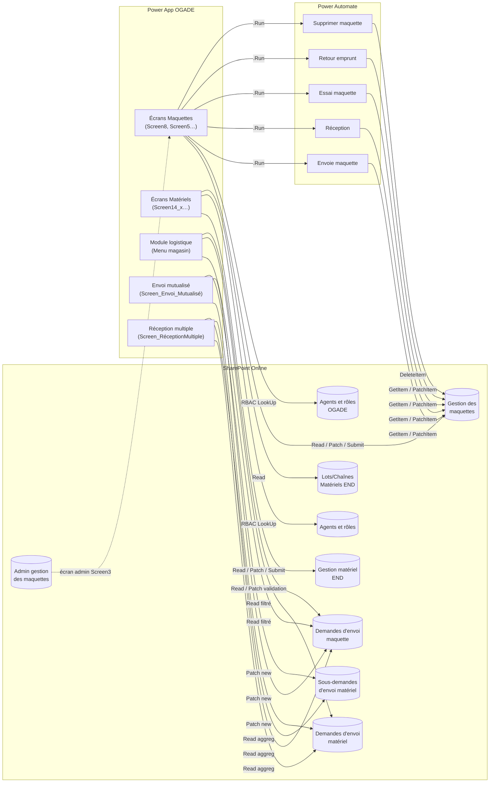
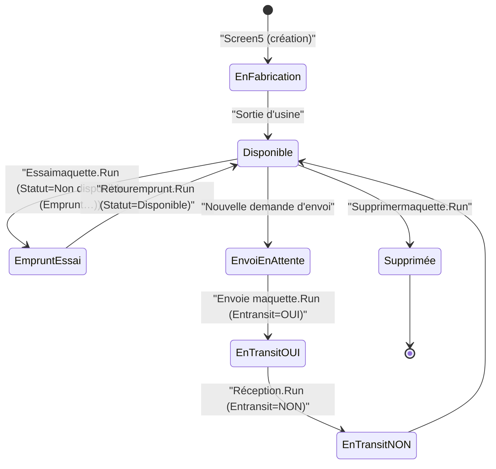

# Cartographie de l'existant — Application Power Apps **OGADE**

> Source analysée : `OGADE_20260414071848/` (package Power Platform exporté le 14/04/2026)
> Dernière modification de l'app : 2026-02-26T18:05:13Z — version `1.348`
> Créateur : `julien.bock@edf.fr` — Environnement : `DISC-DSC-DQI-OGADE`
> Type : Canvas App classique (Tablet 1366×768), démarre sur `Home Page`, `BackEnabled = false`
> Signaux qualité bruts : **175 erreurs de binding**, 0 erreur de parsing

Ce document est une **photographie** de l'existant. Il ne propose aucune cible.

---

## 1. Vue d'ensemble fonctionnelle

L'application OGADE (« Outil de Gestion des Actifs END de la DQI » — EDF / Direction Qualité Inspection) gère le cycle de vie physique et documentaire de deux familles d'actifs :

- **Maquettes** : pièces/éprouvettes de contrôle utilisées pour les essais END (non destructifs) — périmètre site SharePoint `DISC-DSC-DQI-MAQUETTES`.
- **Matériels END** : équipements d'essais non destructifs (sondes, traducteurs, appareils) — périmètre site SharePoint `DISC-DSC-DQI-BTN`.

Les processus couverts sont :

1. Référentiel (création / modification / fiche détail des maquettes et matériels).
2. Réservation ("emprunt") de maquettes pour essais, et retour d'emprunt.
3. Envoi (logistique sortante) vers un destinataire EDF ou externe, avec validations multi-niveaux.
4. Réception de l'actif à destination.
5. Envois multiples / mutualisés (matériels + maquettes dans la même demande).
6. Réception multiple (traitement logistique groupé).
7. Module logistique ("Menu magasin") dédié aux magasiniers et référents.
8. Consultation QR code, pièces jointes, 3D / Mixed Reality.

Habilitations gérées dans SharePoint via deux listes de rôles (`Agents et rôles OGADE` côté maquettes, `Agents et rôles` côté matériels) — rôles principaux : **Magasinier**, **Référent logistique DQI**, **Référent maquette**, **Référent maquette admin**, **OGADE_Matériels_Admin**, **OGADE_Responsable matériel**.

---

## 2. Inventaire des écrans

L'app contient **47 écrans** déclarés. La table ci-dessous les regroupe par domaine fonctionnel, avec leur rôle. Les écrans suffixés `_OLD` / `_Old` sont conservés mais n'apparaissent plus dans la navigation active.

### 2.1 Écran racine et transverse

| Écran | Rôle |
|---|---|
| **Home Page** | Écran d'accueil. Trois tuiles : *Matériels END*, *Maquettes*, *Module logistique*. Bouton « Création d'une demande d'envoi mutualisée ». Contrôle d'accès au Module logistique par LookUp sur les deux listes de rôles ; popup « Ce module est réservé aux équipes logistiques » sinon. Bandeau haut : logo EDF + accès au Mode Opératoire PDF sur SharePoint. |
| **Opératinréunssie** | Écran de succès après action maquette (emprunt). `Refresh` `Gestion des maquettes` puis `Navigate(Informations_Maquette)`. |
| **Opératinréunssie2** | Variante de succès qui renvoie vers `Screen8` (liste maquettes). |
| **EchecOpération** | Écran d'échec (flux non `OK`). Renvoie vers `Informations_Maquette`. |

### 2.2 Domaine Maquettes

| Écran | Rôle |
|---|---|
| **Screen8** | **Hub Maquettes** : galerie filtrable/recherchable sur `Gestion des maquettes`, tri `Créé` décroissant, barre d'actions du bas (Liste / Envoi-Réception / Réservation / Ajout / Infos / Modification). Logique conditionnelle sur `En transit` et `Statut` pour activer l'action Envoi vs Réception. |
| **Informations_Maquette** | Fiche détail d'une maquette sélectionnée. Sections dépliables (`Varmodificationmaquette`, `varCARDHEIGHT`, `Varrot1`). Même barre d'actions que Screen8. |
| **Screen5** | Formulaire de **création / modification** d'une maquette (`Form2`). Variable `Varnewmaquette` (1 = création, 0 = édition). Auto-incrément de `Référence unique` en création, assemblage automatique du `Title` à partir du type de maquette et d'un suffixe. Contrôle de doublon de référence. Supprimer maquette via `Supprimermaquette.Run(Gallery8.Selected.ID)`. |
| **Screen4** | Formulaire dimensions/matières (`Form5`) — Matière multi-valuée, Longueur / Largeur / Hauteur / DN / Épaisseur paroi. |
| **Nouvelle maquette** *(ancienne version)* | Formulaire manuel FluidGrid pré-`Form2` — conservé mais plus dans la navigation principale. |
| **Envoi maquette** | Formulaire de **demande d'envoi maquette**. Deux sous-formulaires (`FormulaireDemandeD'envoiMaquetteSextant`, `…HorsSextant`) selon destinataire. Alimente `Demandes d'envoi maquette`. |
| **Reception maquette** | Formulaire de **réception** d'une maquette dont `En transit = OUI`. `Form1` sur `Gestion des maquettes`. |
| **ScreenEmpruntMaquette** | Formulaire de **réservation pour essai** (emprunt). Contient les champs principaux, calcule et appelle le flux `Essaimaquette.Run(...)`. |
| **Screen10** | Variante/duplicata de `ScreenEmpruntMaquette` (formulaire d'emprunt avec dropdowns Type d'essai / Type d'END, DatePickers, ComboBox Entreprise) — appelle `Essaimaquette.Run(...)`. |
| **Retour emprunt** | Formulaire de **retour d'emprunt** (`Form4_1`). Aboutit à l'appel du flux `Retouremprunt.Run(...)` (via version héritée ; l'appel figure dans `Retour emprunt_OLD`). |
| **Screen2** | **QR code** de la maquette courante. Génération via API QuickChart (`https://quickchart.io/qr?text=…&size=600*600`). Boutons `Download(Image1.Image)` et `Print()`. |
| **Screen7** | **Pièces jointes** de la maquette : galerie des attachments, visionneuse selon extension — image (jpg/png/svg/…), PDF (`PdfViewer1`), 3D (`ViewIn3D2` pour .glb/.obj/.stl), **Réalité mixte** (`ViewInMR2`). |
| **Screen6** | Contrôle Attachments simple en mode `View` sur `Gallery8.Selected.'Pièces jointes'`. |
| **Screen3** | Galerie horizontale de la liste `Admin gestion des maquettes` (écran à vocation administrative). |
| **Screen1** | Étape intermédiaire d'un formulaire d'envoi (carte « Informations d'envoi » + carte « Photo avant envoi »). |

### 2.3 Domaine Matériels END

| Écran | Rôle |
|---|---|
| **Screen14** | **Hub Matériels END** : galerie `Gestion matériel END`, `Toggle1` *Vision matériel / Vision lot-chaîne*. Icône panier (badge = `CountRows(PanierTransfert)`). Barre d'actions bas (Tableau / Envoi-Réception / Réservation / Ajout / Infos / Modification). |
| **Screen14_1** | Détail matériel : `TabList3_1` multi-onglets (Infos, Pièces jointes, Photo Envoie, Photo Réception…). `OnVisible : Set(varTabHeader,"Pièces jointes")`. |
| **Screen14_2** | Formulaire **ajout / modification** matériel (`Form3` sur `Gestion matériel END`). Libellé d'onglet piloté par `VarModifouajout`. |
| **Screen14_3** | Formulaire **prêt / retour** matériel (`Form3_1`). `VariablePrêtmatériel` pilote le mode ("Prêt matériel", "Retour matériel", "Prêt du matériel à un fournisseur"). |
| **Screen14_4** | Formulaire **envoi / réception** matériel. `FormulaireDemandeD'envoiMatériel` alimente `Demandes d'envoi matériel`. `Variabledéplacementmatériel` pilote le libellé. |
| **Screen14_5** | Écran **envoi multiple** matériel depuis le panier `PanierTransfert`. Boucle `SubmitForm(Form3_5); Remove(PanierTransfert, First(PanierTransfert))` jusqu'à panier vide. |
| **Screen14_6** | Variante envoi multiple matériel pour **étalonnage** — même boucle via `Form3_7`. |
| **Screen14_7** | Ajout / modification d'un **Lot / Chaîne Matériels END** (`Form3_9`). Libellé pilote par `VarModifouajout2`. |
| **Screen_EnvoiMultiple_MatérielsEND** | Envoi multiple matériels (tab `"Envoi multiple matériel"`) — `Form3_12`. |
| **Screen_Réservation EDF** | Réservations multiples EDF (`Gallery10_2` sur `Filter('Gestion matériel END', First(PanierTransfert).Titre = Titre)`). |
| **Screen13** | Vue tabulaire / spreadsheet des matériels END (colonnes ID, Type, Localisation, Dates d'étalonnage, Validité, Échéance). |
| **Screen12** | Navigation **Lots / Chaînes** : `Gallery11` sur `Lots/Chaînes Matériels END` + `Gallery12` imbriquée `Filter('Gestion matériel END', 'Lots/Chaînes Matériels END'.Value = ThisItem.Référence)`. |

### 2.4 Module logistique / magasin

| Écran | Rôle |
|---|---|
| **Menu magasin** | Tableau de bord logistique. Bascule `Maquettes / Matériels`. Tables filtrables des demandes en cours. Règles RBAC : les magasiniers ne voient que les demandes `Statut = "Envoi en attente"`. Ouverture de panneaux de **validation** par référent et pôle logistique. Permet d'ouvrir les PJ d'une demande. |
| **Validation maquettes_multiple** | Panneau overlay dans `Menu magasin` — formulaire `Form9_2` sur `Demandes d'envoi maquette` pour la **validation référent maquette** (auto-renseigne `Valideur référent maquette` avec `User()`). Motif de refus visible seulement si `Validation référent maquette = "Refus"`. Masqué pour `Urgence.Value = "Haute"`. |
| **Pièces jointes_demande d'envoi maquettes** | Visionneuse PJ (PDF / DOC / images) pour `TableMagasinEnvoiMaquette.Selected` — utilisée dans le module magasin. |
| **Pièces jointes_demande d'envoi mutualisé** | Visionneuse PJ pour `TableMagasinEnvoiMatériel.Selected` (demandes mutualisées). |

### 2.5 Envois mutualisés et réception multiple

| Écran | Rôle |
|---|---|
| **Screen_Envoi_Mutualisé** | Formulaire unique pour une **demande d'envoi mutualisée** matériel + maquette. Crée d'abord l'enregistrement parent dans `Demandes d'envoi matériel`. Ouvre les écrans de sélection maquette/matériel. |
| **Screen_Envoi_Mutualisé_maquettes_ajout** | Sélecteur de maquettes (même filtre que `Screen8`) alimentant `PanierTransfertMaquette`. |
| **Screen_Envoi_Mutualisé_matériels_ajout** | Sélecteur de matériels END alimentant `PanierTransfert`. |
| **Screen_RéceptionMultiple** | Liste des demandes `Demandes d'envoi matériel` au statut `"Soldée"` avec compteurs d'éléments enfants (jointure sur `Sous-demandes d'envoi matériel` et `Demandes d'envoi maquette`). Sélection d'une ligne → `Set(IDRéceptionMultiple, ThisItem.ID)` → `Screen_RéceptionMultiple_Détails`. |
| **Screen_RéceptionMultiple_Détails** | Vue **détail validation** d'une demande multiple. Deux panneaux : Maquettes (filtre `'ID Demande envoi mère' = IDRéceptionMultiple`) et Matériels (filtre `'Demande d'envoi associée'.Value = IDRéceptionMultiple`). Sélection multiple (`CollectionRéceptionMultipleMatériel`). Actions « Valider la réception » / « Refuser la réception » via popup `PopUpContainer_ValidationRéceptionActifs`. |
| **Screen15** | Vue post-traitement des réceptions multiples, équivalente mais en présentation résultat (statuts `Soldée`). |

### 2.6 Écrans utilitaires / legacy

| Écran | Rôle |
|---|---|
| **Screen9** | Écran de test — seule formule : `Match(TextInputCanvas2.Value , "^[A-Z]")`. |
| **Screen11** | Écran prototype "Brand New Employees" sur données d'échantillon — orphelin fonctionnellement (reliquat template). |
| **Menu principal_OLD** | Ancien menu principal (sans tuile Module logistique). |
| **Envoi maquette_Old** | Ancienne version `Form1_1`. |
| **Reception maquette_OLD** | Ancienne version `Form1`. |
| **Retour emprunt_OLD** | Ancienne version du retour d'emprunt. **Contient encore l'appel complet à `Retouremprunt.Run(...)`** — voir §5. |

### 2.7 Composant

| Composant | Rôle |
|---|---|
| **Component1** | Composant Canvas destiné à abriter la barre d'actions basse commune aux écrans maquettes. Déclaré, mais les écrans utilisent encore des copies inline de la barre. `AllowAccessToGlobals = false`, entrée `Gallery5` de type Table. |


---

## 3. Sources de données SharePoint

Deux sites SharePoint hébergent les 9 listes utilisées. Les deux sites ont été **renommés** : les URLs historiques `https://edfonline.sharepoint.com/sites/DIPNN-DI-MAQUETTES` et `.../DIPNN-DI-BTN` sont redirigées par `datasetOverride` vers `DISC-DSC-DQI-MAQUETTES` et `DISC-DSC-DQI-BTN`. Cette migration explique probablement une partie des 175 erreurs de binding.

Connecteurs utilisés : **SharePoint Online**, **Utilisateurs d'Office 365** (`SearchUser`, `UserPhoto`, `SearchUserV2`), **Office 365 Outlook** (`SendEmailV2`), **Flux logiques** (5 flows — voir §5).

### 3.1 `Gestion des maquettes` (cœur métier — 115 colonnes)

Site `DISC-DSC-DQI-MAQUETTES` · GUID `e32559d8-799a-4117-9f05-a18da7086b55` · lecture/écriture.

| Catégorie | Champs internes manipulés par l'app |
|---|---|
| Identification | `ID` (int), `Title` = Référence (string), `Référenceunique` (`R_x00e9_f_x00e9_renceunique`, double) |
| Classification | `Typedemaquette` (lookup), `Composant` (lookup), `Catégorie` (`Cat_x00e9_gorie`, lookup), `Forme de la maquette` (`Formedelamaquette`, lookup), `Type d'assemblage` (`Typedassemblage`, lookup), `Matière` (`Mati_x00e8_re`, multi-lookup), `Procédures` (`Proc_x00e9_dures`, lookup), `Type de contrôle` (`Typedecontr_x00f4_le`, lookup) |
| État / cycle de vie | `Statut` (lookup), `En transit` (`Entransit`, lookup `OUI`/`NON`), `Référencée ASN` (`R_x00e9_f_x00e9_renc_x00e9_eASN`, lookup), `Hors Patrimoine` (`HorsPatrimoine`, lookup), `Informations certifiées` (bool) |
| Emprunt / essai | `Emprunteur` (personne), `Emprunteur Entreprise` (`EmprunteurEntreprise`, lookup), `Date d'emprunt` (`Datedemprunt`, date), `Date de retour estimée` (`Datederetourestim_x00e9_e`, date) |
| Localisation | `Localisation` (lookup), `Localisation : Entreprise` (`Localisation_x003a_Entreprise`, lookup), `Localisation_Rayonnage`, `Localisation_Salle`, `Compléments localisation` (`Compl_x00e9_mentslocalisation`), `Adresse`, `Adresse : N°Voie`, `Adresse : Nom de la voie`, `Adresse : Code Postal`, `Adresse : Ville`, `Adresse : Pays` (lookup), `Adresse : Site` |
| Dimensions maquette | `Longueurmaquette`, `Largeurmaquette`, `Hauteurmaquette`, `DNmaquette`, `Epaisseurparoimaquette`, `Poidsdelamaquetteenkg`, `Quantité` |
| Défaut | `Longueurd_x00e9_faut`, `Largeurd_x00e9_faut`, `Profondeurd_x00e9_faut`, `Diam_x00e8_tred_x00e9_faut`, `Typeded_x00e9_faut` (lookup), `Descriptiondesd_x00e9_fauts` (string — stocke un **JSON** construit par Power Apps, cf. `DescriptionJSON1`) |
| Colisage | `Colisage_Longueur` (mm), `Colisage_Largeur`, `Colisage_Hauteur`, `Colisage_Poids (kg)`, `Colisage_Description`, `Produits chimiques` (bool) |
| Référentiel / documentaire | `LienECM`, `LienECMRFF`, `Lienphotostexte`, `N°deFIEC`, `Description`, `Commentaires`, `Pièces` (`Pi_x00e8_ces`) |
| Audit / Historique | `Historique` (texte multi-ligne — transit), `Viedelamaquette` (texte multi-ligne — emprunts/essais), `Pôle/Entité` (lookup), `Référent(s) maquette` (multi-personne) |
| Photos / PJ | `Plan` (LargeImage, « Photo maquette envoi »), `Photomaquetten_x002b_1` (LargeImage, « Photo maquette réception »), `{Attachments}` (collection de fichiers) |
| Finances | `Valeurfinanci_x00e8_re`, `Durée de vie` (`Dur_x00e9_edevie`), `Amortissement` |

### 3.2 `Gestion matériel END` (77 colonnes)

Site `DISC-DSC-DQI-BTN` · GUID `d6112d5e-7936-4327-b291-4031ca9a4fc2` · lecture/écriture.

| Catégorie | Champs internes manipulés |
|---|---|
| Identification | `ID`, `Title`, `N°deFIEC`, `Modèle` (`Mod_x00e8_le`), `Typedetraducteur` |
| Classification | `TypeEND` (lookup), `Typedemat_x00e9_riel` (lookup), `Groupe` (lookup), `Site` (lookup), `Lots/Chaînes Matériels END` (lookup, `Lots_x002f_Cha_x00ee_nesMat_x00e0`), `Fournisseur du matériel` (lookup) |
| Étalonnage | `Datedernier_x00e9_talonnage` (date), `Validit_x00e9__x0028_an_x0029_` (double — mois), `Dated_x00e9_ch_x00e9_ance`, `Matériel soumis à vérification périodique ?` |
| Prêt / circulation | `Enpr_x00ea_t` (lookup), `Motifdupr_x00ea_t` (lookup), `Datederetourpr_x00ea_t`, `Entransit` (lookup), `Responsabledelamaquette` (personne) |
| État | `Etatdumat_x00e9_riel` (lookup), `Commentaire_x00e9_tatmat_x00e9_r`, `Compl_x00e9_tude` (lookup), `Commentairescompl_x00e9_tude`, `Information vérifiée ?`, `Produits chimiques` (bool), `Commentaires produits chimiques` |
| Localisation | `Compl_x00e9_mentslocalisation`, `Entreprise` (lookup), `Propriétaire du matériel` (lookup) |
| Photos / PJ | `PhotoEnvoie` (LargeImage), `PhotoR_x00e9_ception` (LargeImage), `{Attachments}` |
| Audit | `Historique` (html), `Commentaires` |

### 3.3 `Lots/Chaînes Matériels END` (27 colonnes)

Site `DISC-DSC-DQI-BTN` · GUID `ae81f761-5cf5-4055-9d4a-77ea60d7427e`. Référentiel des groupements d'équipements. Champs principaux : `ID`, `Title`, `Référence` (`R_x00e9_f_x00e9_rence`). Utilisé par `Screen12` (galerie imbriquée) et `Screen14_7`.

### 3.4 `Admin gestion des maquettes` (28 colonnes)

Site legacy `DIPNN-DI-MAQUETTES` · GUID `012e914c-9db5-4cae-8ee6-c4b1a9694874`. Référentiel d'administrateurs maquettes. Champs : `ID`, `Title`, `Listeadmin` (personne). Utilisé par `Screen3`.

### 3.5 `Agents et rôles OGADE` (40 colonnes) — RBAC maquettes

Site `DISC-DSC-DQI-MAQUETTES` · GUID `eafb397d-c98e-4836-ad54-687e0477bfa1`.
Champs clés : `Agent` (personne), `r_x00f4_le` (lookup), `Site` (lookup), `R_x00e9_f_x00e9_rentlogistiqueDQ` (bool), `R_x00e9_f_x00e9_rentmaquette` (bool), `Magasinier` (bool), `R_x00e9_f_x00e9_rentmaquetteadmi` (bool).
→ Consommée par toutes les formules de type `LookUp('Agents et rôles OGADE', User().Email = Agent.Email).<rôle>`.

### 3.6 `Agents et rôles` (40 colonnes) — RBAC matériels

Site `DISC-DSC-DQI-BTN` · GUID `c42211c8-4b2e-4525-8729-e934148f245e`.
Champs clés : `Nomdelagent` (personne), `P_x00f4_les` (lookup), `P_x00e9_rim_x00e8_tre_OGADE_Mat_` (lookup), booléens d'habilitation : `OGADE_Responsablemat_x00e9_riel`, `REX_AUDIO_Admin`, `RGV_RCCP_Admin`, `R_x00e9_f_x00e9_rentlogistiqueDQ`, `OGADE_Mat_x00e9_riels_Admin`, `FiREX_Admin`.

### 3.7 `Demandes d'envoi maquette` (80 colonnes)

Site `DISC-DSC-DQI-MAQUETTES` · GUID `a0ee0d56-22f9-4d87-be02-b8c679ddbe98`.
Circuit de demande de transport d'une maquette. Colonnes clés :

- Référence métier : `Maquette` (lookup), `ID Demande envoi mère` (`ID_x0020_Demande_x0020_envoi_x00`, double — clé pour rattacher à une demande mutualisée), `Title`, `Statut` (lookup), `Statut : Réception` (`Statut_x003a_R_x00e9_ception`, lookup).
- Destinataire : `Destinataire : Nom/Entreprise/N° de téléphone/N° de voie/Nom de la voie/Code postal/Pays/Adresse mail/Ville`, `Adressededestination`.
- Circuit de validation : `Urgence` (lookup), `Justificationdelurgence`, `Justificationdusurco_x00fb_tdema` (surcoût demande urgente), `Surco_x00fb_t` (double), `Demandeurgente_x003a_OTP`, `Demandeurgente_x003a_Manager` (personne), `Validationp_x00f4_lelogistique` (lookup), `Datedevalidationp_x00f4_lelogist` (datetime), `R_x00e9_f_x00e9_rentlogistiqueay` (personne), `Validationr_x00e9_f_x00e9_rentma` (lookup), `Valideurr_x00e9_f_x00e9_rentmaqu` (personne), `Datedevalidationr_x00e9_f_x00e9_` (datetime), `Motifdurefus`.
- Exécution : `Datedenvoisouhait_x00e9_e` (date), `Datedenvoimagasin` (date), `Personneayantr_x00e9_alis_x00e9_` (personne), `Motifdelenvoi`, `Photodelenvoi` (LargeImage), `Photoenvoieffectu_x00e9_e_x003f_`, `Datephotoenvoi`, `Personneayantr_x00e9_alis_x00e9_0` (personne photo), `Souscriptionduneassurance`, `Convention` (bool), `Justificationpasdeconvention`, `Contact`, `Contact : N° de tel`.

### 3.8 `Demandes d'envoi matériel` (81 colonnes)

Site `DISC-DSC-DQI-BTN` · GUID `bc1b1677-afee-44b2-aade-64ecfb701eb4`. Équivalent côté matériels, avec quelques spécificités : `Groupe`, `Site`, `Datederetoursouhait_x00e9_e`, `Photo : Envoi/Photo : Réception` (séparées), `Poids/Longueur/Largeur/Hauteur Colisage` (strings), `Urgence` (bool), `Matériels supplémentaires non listés` (string libre), `Statut : Réception_Matériels_non_listés`, `Contient des produits chimiques ?`, `Validation référent matériel`.

### 3.9 `Sous-demandes d'envoi matériel` (72 colonnes)

Site `DISC-DSC-DQI-BTN` · GUID `10ca23cc-154d-445f-9b89-ec0d7302cf6f`. Une ligne par **matériel** rattaché à une demande mère (relation 1-N matérialisée par `Demandedenvoiassoci_x00e9_e` lookup, avec ~10 colonnes de projection `Demande d'envoi associée: …`). Contient le workflow unitaire (photo, validation référent matériel, motif refus, statut réception).

### 3.10 Liens inter-listes observés

- `Sous-demandes d'envoi matériel.Demandedenvoiassoci_x00e9_e` → `Demandes d'envoi matériel.ID`
- `Demandes d'envoi maquette.ID_x0020_Demande_x0020_envoi_x00` → `Demandes d'envoi matériel.ID` (cross-site — clé technique portée dans le Power App lui-même : `Filter('Demandes d''envoi maquette', 'ID Demande envoi mère' = IDMatérielENVOI)`)
- `Demandes d'envoi maquette.Maquette` → `Gestion des maquettes.ID`
- `Gestion matériel END.Lots_x002f_Cha_x00ee_nesMat_x00e0` → `Lots/Chaînes Matériels END`


---

## 4. Formules et logique métier

Cette section recense les formules Power Fx les plus structurantes observées dans le code. Elles sont regroupées par intention métier plutôt que par écran.

### 4.1 Contrôle d'accès et rôles

Tous les tests RBAC s'appuient sur un `LookUp` / `First(Filter(...))` sur les deux listes de rôles, avec l'email `User().Email` comme clé.

```powerfx
// Accès au Module logistique (Home Page)
If(
    LookUp('Agents et rôles OGADE', User().Email = Agent.Email).Magasinier
      Or LookUp('Agents et rôles OGADE', User().Email = Agent.Email).'Référent logistique DQI'
      Or LookUp('Agents et rôles OGADE', User().Email = Agent.Email).'Référent maquette'
      Or LookUp('Agents et rôles', User().Email = 'Nom de l''agent'.Email).OGADE_Matériels_Admin,
    Navigate('Menu magasin'),
    Set(PopUpModuleMagasinseulement, true)
)

// Grisage du bouton Envoi mutualisé pour les magasiniers
If(
    First(Filter('Agents et rôles OGADE', User().Email = Agent.Email)).Magasinier,
    DisplayMode.Disabled,
    DisplayMode.Edit
)
```

Le même motif (`First(Filter('Agents et rôles OGADE', User().Email = Agent.Email)).<rôle>`) conditionne :

- `DisplayMode` des icônes d'action Envoi, Réception, Ajout, Modification sur `Screen8` et `Informations_Maquette` ;
- le filtrage des demandes affichées dans `Menu magasin` (un magasinier n'affiche que les statuts `"Envoi en attente"`) ;
- l'accès au mode édition d'une maquette (`Référent maquette`).

### 4.2 Action combinée Envoi / Réception (écran Screen8)

Le bouton unique Envoi/Réception reroute selon l'état `En transit` :

```powerfx
If(Gallery8.Selected.'En transit'.Value = "OUI",
    Navigate('Reception maquette');
    EditForm(Form1);
    Set(Varadresse, Blank());
    Set(VaradresseEntreprise, Blank())
,
    Navigate('Envoi maquette');
    NewForm('FormulaireDemandeD''envoiMaquetteSextant');
    NewForm('FormulaireDemandeD''envoiMaquetteHorsSextant');
    EditForm(Form1_1)
)
```

La `DisplayMode` de ce bouton est elle-même conditionnée :

```powerfx
If(
    (Gallery8.Selected.Statut.Value = "Disponible"
       Or Gallery8.Selected.Statut.Value = "En cours de fabrication")
      Or Gallery8.Selected.'En transit'.Value = "Envoi en attente",
    DisplayMode.Disabled,
    If(First(Filter('Agents et rôles OGADE', User().Email = Agent.Email)).Magasinier,
       DisplayMode.Disabled,
       DisplayMode.Edit
    )
)
```

Rotation de l'icône selon le sens (180° en réception) : `If(Gallery8.Selected.'En transit'.Value = "OUI", 180, 0)`.

### 4.3 Action combinée Réservation / Retour d'emprunt

```powerfx
If(
    Gallery8.Selected.Statut.Value = "Disponible",
    Navigate(ScreenEmpruntMaquette); EditForm(Form4_2),
    Navigate('Retour emprunt'); EditForm(Form4_1)
)
```

### 4.4 Filtre principal de la galerie maquettes (`Screen8.Gallery8.Items`)

Filtre multi-critères en ET logique : recherche par référence, par localisation (entreprise + site), `En transit`, `Statut`, forme, composant, catégorie, puis plages min/max sur 5 dimensions.

```powerfx
Sort(
    Filter('Gestion des maquettes',
        IsBlank(TextInput1_3.Text) || TextInput1_3.Text = Référence,
        IsBlank(ComboBox1_2.Selected) || ComboBox1_2.Selected.Value = 'Localisation : Entreprise'.Value,
        IsBlank(ComboBox1_3.Selected) || ComboBox1_3.Selected.Value = Localisation.Value,
        IsBlank(ComboBox1_11.Selected) || ComboBox1_11.Selected.Value = 'En transit'.Value,
        IsBlank(ComboBox1_10.Selected) || ComboBox1_10.Selected.Value = Statut.Value,
        IsBlank(ComboBox1_8.Selected) || ComboBox1_8.Selected.Value = 'Forme de la maquette'.Value,
        IsBlank(ComboBox1_4.Selected) || ComboBox1_4.Selected.Value = Composant.Value,
        IsBlank(TextInput4_2.Text) || 'Hauteur maquette' >= Value(TextInput4_2.Text),
        IsBlank(TextInput4_1.Text) || 'Hauteur maquette' <= Value(TextInput4_1.Text)
        /* + plages idem pour largeur, longueur, DN, épaisseur */
    ),
    Créé, SortOrder.Descending
)
```

Même pattern réutilisé dans `Screen_Envoi_Mutualisé_maquettes_ajout` pour la sélection multiple.

### 4.5 Filtre du tableau Menu magasin (demandes maquettes)

```powerfx
Sort(
    Filter('Demandes d''envoi maquette',
        IsBlank(DataCardValue196.Selected) || Statut.Value = DataCardValue196.Selected.Value,
        /* filtres urgence, validation pôle logistique, validation référent maquette */
        LookUp('Agents et rôles OGADE', User().Email = Agent.Email).Magasinier = false
          || Statut.Value = "Envoi en attente",
        IsBlank('ID Demande envoi mère'),
        SearchBar_GTFNC.Text in Maquette.Value
    ),
    Créé, SortOrder.Descending
)
```

Deux règles métier importantes :

- `IsBlank('ID Demande envoi mère')` — on n'affiche **que les demandes racines**, les sous-demandes d'une mutualisée n'apparaissent pas ici.
- Les magasiniers sont filtrés sur `"Envoi en attente"` uniquement ; les autres rôles voient tout.

### 4.6 Compteurs de validation (écran de réception multiple)

```powerfx
// Validations "Oui"
CountRows(Filter('Sous-demandes d''envoi matériel',
    'Demande d''envoi associée'.Value = Text(IDMatérielENVOI),
    'Validation référent matériel'.Value = "Oui")) +
CountRows(Filter('Demandes d''envoi maquette',
    'ID Demande envoi mère' = IDMatérielENVOI,
    'Validation pôle logistique'.Value = "Oui",
    'Validation référent maquette'.Value = "Oui"))

// Validations "Refus"
CountRows(Filter('Sous-demandes d''envoi matériel',
    'Demande d''envoi associée'.Value = Text(IDMatérielENVOI),
    'Validation référent matériel'.Value = "Refus")) +
CountRows(Filter('Demandes d''envoi maquette',
    'ID Demande envoi mère' = IDMatérielENVOI,
    'Validation pôle logistique'.Value = "Refus"
      Or 'Validation référent maquette'.Value = "Refus"))
```

Remarque : les ID mère sont manipulés tantôt comme nombre (côté `Demandes d'envoi maquette`), tantôt comme `Text(IDMatérielENVOI)` côté sous-demandes matériel — la typisation dépend de la colonne SharePoint (cf. §3.10).

### 4.7 Galeries de réception multiple (détail)

```powerfx
// Maquettes enfants d'une demande mutualisée
Filter('Demandes d''envoi maquette',
    'ID Demande envoi mère' = IDRéceptionMultiple,
    Statut.Value = "Soldée")

// Matériels enfants d'une demande mutualisée
Filter('Sous-demandes d''envoi matériel',
    'Demande d''envoi associée'.Value = Text(IDRéceptionMultiple),
    Statut.Value = "Soldée")

// Liste des demandes à réceptionner (Screen_RéceptionMultiple)
Sort(
    Filter('Demandes d''envoi matériel', Statut.Value = "Soldée"),
    Créé, SortOrder.Descending
)
```

### 4.8 Création / modification de maquette (`Screen5`)

Points structurants :

- **Auto-incrément** de `Référence unique` en mode création :
  ```powerfx
  First(Sort('Gestion des maquettes', 'Référence unique', SortOrder.Descending)).'Référence unique' + 1
  ```
- **Assemblage automatique** du `Title` : `Left(DataCardValue8.Selected.Value,2) & DataCardValue9.Text` — préfixe à 2 caractères du type de maquette + suffixe libre.
- **Contrôle de doublon** (affichage rouge) :
  ```powerfx
  If(Varnewmaquette = 1,
     If(IsBlank(LookUp('Gestion des maquettes', Référence = DataCardValue32.Text)), false, true),
     false)
  ```
- **Suppression** : appelle le flux `Supprimermaquette.Run(Gallery8.Selected.ID)` puis, en cas d'échec, navigue vers `EchecOpération` — l'état local est tracé dans `SuppressionCollection`.
- **Collecte des défauts** (tab 1 des défauts) : chaque ligne de `Gallery3.AllItems` est projetée dans la collection `DéfautValeursTab1` :
  ```powerfx
  ForAll(Gallery3.AllItems,
      Collect(DéfautValeursTab1, {
          Hauteur: Hauteur.Text, Longueur: Longueur.Text, Largeur: Largeur.Text,
          Profondeur: Profondeur.Text, Diamètre: Diamètre.Text,
          Numéro: Numéro_3.Value, Type: Type.Selected.Value
      })
  )
  ```
  Le résultat est sérialisé dans la variable `DescriptionJSON1`, elle-même persistée dans le champ SharePoint `Descriptiondesd_x00e9_fauts`.

### 4.9 Soumission de formulaires (pattern récurrent)

Tous les écrans de type formulaire partagent le même pattern `If(Form.Valid, SubmitForm(Form); Navigate(retour), SubmitForm(Form))` — la branche « invalide » se contente d'appeler `SubmitForm` pour que Power Apps affiche les messages d'erreur.

Exemples :

```powerfx
// Reception maquette (Form4) → retour Screen8
If(Form4.Valid, SubmitForm(Form4); Navigate(Screen8), SubmitForm(Form4))

// Screen5 (Form2) → retour Screen8
If(Form2.Valid, SubmitForm(Form2); Navigate(Screen8), SubmitForm(Form2))

// ScreenEmpruntMaquette (Form4_2)
If(Form4_2.Valid, SubmitForm(Form4_2); Navigate(Screen8), SubmitForm(Form4_2))

// Retour emprunt (Form4_1)
If(Form4_1.Valid, SubmitForm(Form4_1); Navigate(Screen8), SubmitForm(Form4_1))

// Screen14_x : boucle sur panier (envoi multiple)
If(Form3_5.Valid,
   SubmitForm(Form3_5);
   Remove(PanierTransfert, First(PanierTransfert));
   If(IsEmpty(PanierTransfert), Navigate(Screen14), EditForm(Form3_5)),
   SubmitForm(Form3_5))
```

### 4.10 Panneau de validation référent (`Validation maquettes_multiple`)

Auto-alimentation du champ `Valideur référent maquette` avec les données utilisateur courant :

```powerfx
// Update du DataCard Valideur
{ Claims: "i:0#.f|membership|" & User().Email,
  Department: Office365Users.MyProfileV2().department,
  DisplayName: User().FullName,
  Email: User().Email,
  JobTitle: Office365Users.MyProfileV2().jobTitle }
```

Visibilité conditionnelle :

- Motif de refus visible seulement si `'Validation référent maquette'.Value = "Refus"`.
- Bloc masqué entièrement si `Urgence.Value = "Haute"` (circuit d'urgence bypassant la validation référent).

### 4.11 Bibliothèque d'appels de flux Power Automate

Les appels `.Run(...)` recensés dans les écrans actifs :

```powerfx
// Réservation/essai maquette
ClearCollect(Empruntmaquetteresultat,
    Essaimaquette.Run(
        Dropdown1.Selected.Value,        // Type d'essai
        Dropdown1_1.Selected.Value,      // Type d'END (UT/RT/ET/VT/PT/MT)
        TextInput3.Text,                 // Type essai destructif libre
        TextInput4.Text,                 // Nom responsable
        TextInput3_1.Text,               // Compléments
        Text(DatePicker1.SelectedDate, "yyyy-mm-dd"),
        Gallery8.Selected.ID,
        Gallery8.Selected.Référence,
        Text(DatePicker1_4.SelectedDate, "yyyy-mm-dd"),
        If(ComboBox4_1.Selected.Value = "EDF",
            "Non disponible (Emprunt DI)",
            "Non disponible (Emprunt " & ComboBox4_1.Selected.Value & ")"),
        ComboBox4_1.Selected.Value
    )
);
If(First(Empruntmaquetteresultat).résultat = "OK",
   Navigate(Opératinréunssie),
   Navigate(EchecOpération))

// Suppression maquette
ClearCollect(SuppressionCollection,
    Supprimermaquette.Run(Gallery8.Selected.ID))

// Retour emprunt (code encore présent dans Retour emprunt_OLD)
ClearCollect(ValeurRetourEmprunt,
    Retouremprunt.Run(Gallery8.Selected.ID, Gallery8.Selected.Référence, Text(...)))
If(First(ValeurRetourEmprunt).resultat = "OK",
   Navigate(Opératinréunssie),
   Navigate(EchecOpération))
```

### 4.12 Paniers de transfert (collections volatiles)

Le fonctionnement « envoi multiple » s'appuie sur deux collections en mémoire :

- `PanierTransfert` — pour les matériels END. Alimenté via un bouton « Ajouter au panier » dans `Screen14` / `Screen_Envoi_Mutualisé_matériels_ajout`. Compteur affiché dans un `BadgeCanvas` (`CountRows(PanierTransfert)`).
- `PanierTransfertMaquette` — idem pour les maquettes.

Le vidage est progressif : chaque soumission retire l'élément courant (`Remove(PanierTransfert, First(PanierTransfert))`). Quand `IsEmpty(PanierTransfert)`, l'écran retourne au hub. **Aucune persistance** : un rafraîchissement perd l'état du panier.


---

## 5. Flux Power Automate

Les 5 flux (`Microsoft.Flow/flows/*/definition.json`) sont tous déclenchés par **PowerAppV2** (bouton depuis l'app) et s'exécutent avec l'identité de l'appelant (pattern *Invoker*). Ils ciblent tous la même liste SharePoint : `Gestion des maquettes` (`e32559d8-799a-4117-9f05-a18da7086b55`) sur le site `DISC-DSC-DQI-MAQUETTES`. Aucune condition, aucune boucle — ils sont strictement linéaires.

### 5.1 `Envoie maquette` (`ed09a532-…`)

| Étape | Action | Détail |
|---|---|---|
| 1 | `GetItem` | Lit l'item par ID pour préserver l'`Historique`. |
| 2 | `PatchItem` | Met à jour `Title`, `Localisation`, `Localisation:Entreprise`, préfixe l'`Historique` avec `• Le {date}, la maquette a été envoyée à {Entreprise}, à {Localisation}. Personne ayant réalisé l'envoie : {Envoyeur}. Motif : {Motif}`, force `Entransit = "OUI"`. |
| 3 | `Response` | Retourne `{resultat: "OK"}`. |

Paramètres : `number` (ID), `text` (Titre), `text_1` (Localisation), `text_2` (Envoyeur), `text_3` (Localisation Entreprise), `date` (Date d'envoi), `text_4` (Motif).

### 5.2 `Réception` (`c8600808-…`)

| Étape | Action | Détail |
|---|---|---|
| 1 | `GetItem` | Lit l'item (pour `Historique`). |
| 2 | `PatchItem` | Met à jour `Title`, `Localisation`, `Localisation:Entreprise`, préfixe `Historique` : `• {date} : Réception de la maquette à {Localisation} par {Nom}. Remarques : {Remarques}`, force `Entransit = "NON"`. |
| 3 | `Response` | `{résultat: "OK"}`. |

Paramètres : `number` (ID), `text` (Titre), `date` (Date réception), `text_1` (Nom), `text_2` (Localisation), `text_3` (Localisation Entreprise), `text_4` (Remarques).

### 5.3 `Essai maquette` (`89f2dd5e-…`)

| Étape | Action | Détail |
|---|---|---|
| 1 | `GetItem` | Lit l'item (pour `Viedelamaquette`). |
| 2 | `PatchItem` | Met à jour `Title` ; préfixe `Viedelamaquette` avec `• Du {date} au {date_1}, la maquette a été réservée par {Nom} pour {Entreprise}. La maquette a subi un {Type d'essai} de type : {END}{ED}. Complément d'information : {Description}.` ; renseigne `Datedemprunt`, `Datederetourestim_x00e9_e`, `Statut = {Disponibilité}`, `Emprunteur = {Nom}` (People). |
| 3 | `Response` | `{résultat: "OK"}`. |

Paramètres : `text` (Type d'essai), `text_1` (END), `text_2` (ED), `text_3` (Nom), `text_4` (Disponibilité), `text_5` (Description), `text_6` (Titre), `text_7` (Entreprise), `date` (Date essai), `date_1` (Date retour), `number` (ID).

### 5.4 `Retour emprunt` (`775348b0-…`)

| Étape | Action | Détail |
|---|---|---|
| 1 | `GetItem` | Lit l'item (pour `Viedelamaquette`). |
| 2 | `PatchItem` | Met à jour `Title` ; préfixe `Viedelamaquette` avec `• La maquette à été rendu le {date} par {retour personne}. Compléments : {Compléments}.` ; **réinitialise** `Datedemprunt = null`, `Datederetourestim_x00e9_e = null`, `Emprunteur = null` ; force `Statut = "Disponible"` (en dur). |
| 3 | `Response` | `{resultat: "OK"}`. |

### 5.5 `Supprimer maquette` (`fc03c8ee-…`)

| Étape | Action | Détail |
|---|---|---|
| 1 | `DeleteItem` | Supprime directement l'item par ID (pas de soft-delete, pas de confirmation). |
| 2 | `Response` | `{résultat: "OK"}`. |

### 5.6 Règles consolidées observées

- Deux journaux séparés dans `Gestion des maquettes` :
  - `Historique` : événements logistiques (envoi / réception).
  - `Viedelamaquette` : événements d'usage (essai / retour).
- Chaque flux **préfixe** (et non remplace) le journal — l'ordre de lecture est anti-chronologique.
- `Entransit` est la seule source de vérité sur le transit (`OUI`/`NON`).
- `Statut = "Disponible"` est **écrit en dur par le flux `Retour emprunt`** ; les autres flux acceptent la valeur fournie par l'app.
- Aucun flux n'envoie d'email : le connecteur Outlook est déclaré côté app (`SendEmailV2`) mais son appel n'est pas couvert par la sous-ensemble de code examiné ici (aucun hit `Office365Outlook.SendEmailV2(...)` dans les écrans analysés).
- Aucun flux ne traite les matériels END : toutes les mises à jour `Gestion matériel END`, `Demandes d'envoi matériel`, `Sous-demandes d'envoi matériel` passent par des formulaires `SubmitForm` / `Patch` **directs** depuis l'app.


---

## 6. Diagramme logique des flux entre écrans

Le graphe ci-dessous consolide les `Navigate(...)` observés dans les écrans actifs. Les libellés d'arcs indiquent la condition ou l'événement déclencheur.

### 6.1 Vue d'ensemble

```mermaid
flowchart TD
    HP["Home Page"]

    subgraph MAQ["Domaine Maquettes"]
        S8["Screen8<br/>(hub liste)"]
        INFO["Informations_Maquette<br/>(fiche détail)"]
        S5["Screen5<br/>(création / édition)"]
        S4["Screen4<br/>(dimensions)"]
        ENV["Envoi maquette"]
        REC["Reception maquette"]
        EMP["ScreenEmpruntMaquette"]
        RET["Retour emprunt"]
        S10["Screen10<br/>(form emprunt)"]
        QR["Screen2<br/>(QR code)"]
        PJ["Screen7<br/>(pièces jointes 3D/PDF/MR)"]
    end

    subgraph MAT["Domaine Matériels END"]
        S14["Screen14<br/>(hub matériels)"]
        S141["Screen14_1<br/>(infos)"]
        S142["Screen14_2<br/>(ajout/modif)"]
        S143["Screen14_3<br/>(prêt/retour)"]
        S144["Screen14_4<br/>(envoi/réception)"]
        S145["Screen14_5<br/>(envoi multiple)"]
        S146["Screen14_6<br/>(étalonnage multi)"]
        S147["Screen14_7<br/>(lot/chaîne)"]
        S13["Screen13<br/>(tableau)"]
        S12["Screen12<br/>(lots/chaînes)"]
        ENVM["Screen_EnvoiMultiple_MatérielsEND"]
        RES["Screen_Réservation EDF"]
    end

    subgraph MUT["Envois mutualisés & réception multiple"]
        MU["Screen_Envoi_Mutualisé"]
        MUM["Screen_Envoi_Mutualisé_maquettes_ajout"]
        MUN["Screen_Envoi_Mutualisé_matériels_ajout"]
        RM["Screen_RéceptionMultiple"]
        RMD["Screen_RéceptionMultiple_Détails"]
        S15["Screen15"]
    end

    subgraph LOG["Module logistique"]
        MM["Menu magasin"]
        VM["Validation maquettes_multiple"]
        PJM["Pièces jointes_demande d'envoi maquettes"]
        PJX["Pièces jointes_demande d'envoi mutualisé"]
    end

    subgraph RES2["Retours"]
        OK1["Opératinréunssie"]
        OK2["Opératinréunssie2"]
        KO["EchecOpération"]
    end

    HP -- "tuile Maquettes" --> S8
    HP -- "tuile Matériels END" --> S14
    HP -- "tuile Module logistique (RBAC)" --> MM
    HP -- "bouton Envoi mutualisé" --> MU
    HP -- "bouton Réception multiple (disabled)" --> RM

    S8 -- "QR code" --> QR
    S8 -- "pièces jointes" --> PJ
    S8 -- "infos" --> INFO
    S8 -- "ajout / modif" --> S5
    S8 -- "Statut=Disponible" --> EMP
    S8 -- "Statut≠Disponible" --> RET
    S8 -- "En transit=OUI" --> REC
    S8 -- "En transit=NON/envoi" --> ENV
    S8 -. "réservation matériel" .-> S143
    INFO --> S8
    S5 --> S8
    S4 --> S5
    ENV --> S8
    REC --> S8
    EMP --> S8
    RET --> S8
    S10 --> OK1
    S10 --> KO
    QR --> S8
    PJ --> S8

    S14 -- "infos" --> S141
    S14 -- "ajout matériel" --> S142
    S14 -- "ajout lot/chaîne" --> S147
    S14 -- "prêt / retour" --> S143
    S14 -- "envoi / réception" --> S144
    S14 -- "envoi multiple" --> ENVM
    S14 -- "étalonnage multi" --> S146
    S14 -. "réservations EDF" .-> RES
    S141 --> S14
    S142 --> S14
    S143 --> S14
    S144 --> S14
    S145 --> S14
    S146 --> S14
    S147 --> S14
    S13 --> S14
    S12 --> S14

    MU --> MUM
    MU --> MUN
    MUM --> MU
    MUN --> MU
    RM --> RMD
    RMD --> RM
    S15 -. "variante résultat" .-> RMD

    MM -- "PJ envoi maquette" --> PJM
    MM -- "PJ envoi mutualisé" --> PJX
    MM -- "validation référent" --> VM
    PJM --> MM
    PJX --> MM

    EMP -- "Essaimaquette.Run OK" --> OK1
    EMP -- "Essaimaquette.Run KO" --> KO
    RET -- "Retouremprunt.Run" --> OK1
    S5 -- "Supprimermaquette.Run" --> OK2

    OK1 --> INFO
    OK2 --> S8
    KO --> INFO
```



### 6.2 Flux de données SharePoint ⇄ écrans



### 6.3 Cycle de vie d'une maquette (états observés)



Champs qui portent l'état : `Statut` (Disponible, En cours de fabrication, Sortie d'usine, Non disponible (Emprunt …)), `En transit` (OUI / NON / Envoi en attente), `Emprunteur` + `Datedemprunt` + `Datederetourestim_x00e9_e` pour l'emprunt.

---

## 7. Points d'attention factuels relevés

Ces éléments sont des constats, pas des recommandations.

- **Écrans obsolètes encore packagés** : `Menu principal_OLD`, `Envoi maquette_Old`, `Reception maquette_OLD`, `Retour emprunt_OLD`, `Nouvelle maquette`. L'appel à `Retouremprunt.Run(...)` figure encore dans la version `_OLD`, ce qui soulève la question de savoir laquelle des deux versions pilote réellement l'appel du flux.
- **Duplication fonctionnelle** : `Screen10` et `ScreenEmpruntMaquette` hébergent chacun un formulaire d'emprunt avec le même appel `Essaimaquette.Run`. Barre d'actions basse dupliquée à l'identique dans 6 écrans maquettes (Screen8, Informations_Maquette, Envoi maquette, Reception maquette, ScreenEmpruntMaquette, Retour emprunt) alors qu'un composant `Component1` existe pour la factoriser.
- **Mix typage clé** : `ID Demande envoi mère` est comparée tantôt comme nombre (`= IDMatérielENVOI`), tantôt comme chaîne (`= Text(IDMatérielENVOI)`) selon la liste. Relation inter-sites (`DISC-DSC-DQI-MAQUETTES` ↔ `DISC-DSC-DQI-BTN`) portée manuellement par l'app et non par une colonne SharePoint lookup.
- **Migration d'URL SharePoint** : les deux sites ont été renommés (`DIPNN-DI-*` → `DISC-DSC-DQI-*`). Les `datasetOverride` neutralisent la plupart des impacts, mais les 175 erreurs de binding observées dans `Properties.json` peuvent en être un effet.
- **État non persistant** : paniers `PanierTransfert` / `PanierTransfertMaquette` purement en mémoire — un refresh perd la sélection de l'utilisateur.
- **Écran prototype résiduel** : `Screen11` est une démo « Brand New Employees » sur données d'exemple, sans lien fonctionnel avec OGADE.
- **Bouton désactivé en accueil** : « Réception multiple » est déclaré avec `DisplayMode = DisplayMode.Disabled` sur la Home Page, alors que le sous-système `Screen_RéceptionMultiple` + `Screen_RéceptionMultiple_Détails` est complet par ailleurs (accessible via barre Matériels END).
- **URL externe** : génération de QR code via `https://quickchart.io/qr` — dépendance SaaS publique non EDF.
- **Champ JSON embarqué** : `Descriptiondesd_x00e9_fauts` stocke un JSON sérialisé par l'app (`DescriptionJSON1`) plutôt qu'un schéma SharePoint structuré.
- **Connecteurs déclarés non vus en usage** dans le corpus analysé : `Office365Outlook.SendEmailV2` et plusieurs appels de `Office365Users.MyProfileV2` — à confirmer par une recherche exhaustive des sources le cas échéant.

---

## 8. Index des fichiers analysés

- Manifeste package : `OGADE_20260414071848/manifest.json`
- Définition app : `OGADE_20260414071848/Microsoft.PowerApps/apps/7541278860849329485/7541278860849329485.json`
- Package Canvas décompilé : `OGADE_20260414071848/_extracted/`
  - 47 `Src/*.pa.yaml` (screens + composants)
  - `References/DataSources.json` (9 listes SharePoint + connecteurs)
  - `References/Resources.json` (32 ressources image)
  - `Properties.json`, `Header.json`, `ComponentsMetadata.json`
- Flux Power Automate : `OGADE_20260414071848/Microsoft.Flow/flows/<guid>/definition.json`
  - `c8600808-…` Réception · `ed09a532-…` Envoie maquette · `89f2dd5e-…` Essai maquette · `fc03c8ee-…` Supprimer maquette · `775348b0-…` Retour emprunt
